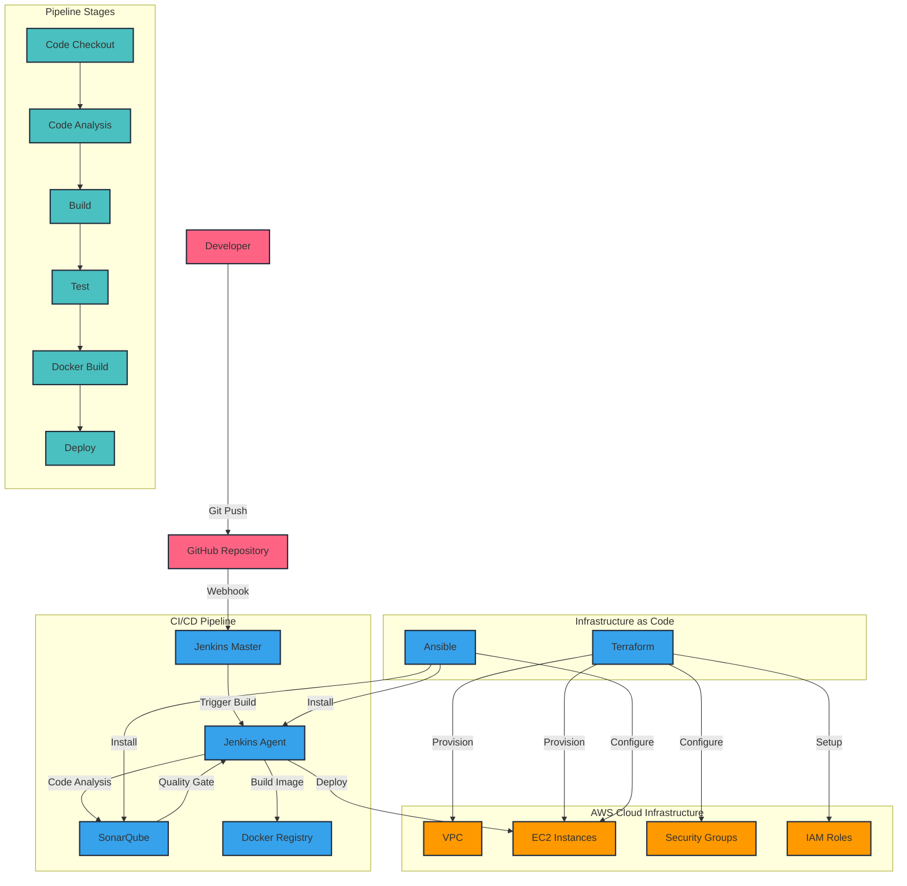

# CloudDevOpsProject 🚀

Welcome to the **CloudDevOpsProject**! This project demonstrates a comprehensive DevOps workflow, integrating various tools and technologies to automate and manage infrastructure and application deployment. The key components include:

- **Docker** 🐳: Containerization of applications for consistent environments across development and production.
- **Terraform** 🌍: Infrastructure as Code (IaC) to provision and manage AWS resources.
- **Ansible** 🔧: Configuration management and automation of server setups.
- **SonarQube** 🔍: Continuous inspection of code quality to detect bugs and vulnerabilities.
- **Jenkins** 🎡: Continuous Integration and Continuous Deployment (CI/CD) automation.

## Table of Contents

1. [Project Overview](#project-overview)
2. [Architecture Diagram](#architecture-diagram)
3. [Prerequisites](#prerequisites)
4. [Installation and Setup](#installation-and-setup)
   - [1. Clone the Repository](#1-clone-the-repository)
   - [2. Infrastructure Provisioning with Terraform](#2-infrastructure-provisioning-with-terraform)
   - [3. Configuration Management with Ansible](#3-configuration-management-with-ansible)
   - [4. Application Deployment with Docker](#4-application-deployment-with-docker)
   - [5. Continuous Integration with Jenkins](#5-continuous-integration-with-jenkins)
   - [6. Code Quality Analysis with SonarQube](#6-code-quality-analysis-with-sonarqube)
5. [Usage](#usage)
6. [Project Structure](#project-structure)
7. [Contributing](#contributing)
8. [Contact](#contact)

## Project Overview

This project showcases a full-fledged DevOps pipeline that automates the process of infrastructure provisioning, configuration management, application deployment, code quality analysis, and continuous integration/delivery. By leveraging tools like Docker, Terraform, Ansible, SonarQube, and Jenkins, it ensures a streamlined and efficient workflow for deploying applications on AWS.

## Architecture Diagram




## Prerequisites

Before you begin, ensure you have the following installed on your local machine:

- **Git** for version control.
- **Docker** for containerization.
- **Terraform** for infrastructure provisioning.
- **Ansible** for configuration management.
- **Jenkins** for CI/CD automation.
- **SonarQube** for code quality analysis.
- **AWS CLI** for interacting with AWS services.

* **Python:** Make sure you have python installed on your machine 🐍
  - you can also install `pip` using `sudo apt update && sudo apt install python3-pip`

Additionally, ensure you have:

- An **AWS account** with the necessary permissions to create resources.
- Configured your AWS credentials locally.

## Installation and Setup

Follow these steps to set up and run the project:

### 1. Clone the Repository

```bash
git clone https://github.com/mujemi26/CloudDevOpsProject.git
cd CloudDevOpsProject
```

### 2. Infrastructure Provisioning with Terraform

Navigate to the Terraform directory and initialize the configuration:

```bash
cd Terraform-aws-infrastructure_components
terraform init
```

Review the execution plan:

```bash
terraform plan
```

Apply the configuration to provision the infrastructure:

```bash
terraform apply
```

Note: Ensure that your AWS credentials are configured correctly and have the necessary permissions.
- [Full Terraform Guide Here](./Terraform-aws-infrastructure_components/README.md)
### 3. Configuration Management with Ansible

After provisioning the infrastructure, use Ansible to configure the EC2 instances:

```bash
cd ../Ansible-Roles-for-EC2-Configuration_components
ansible-playbook -i inventory main.yml
```

Note: Update the inventory file with the public IP addresses of your EC2 instances.
- [Full Ansible Guide Here](./Ansible-Roles-for-EC2-Configuration_components/README.md)
### 4. Application Deployment with Docker

Build and run the Docker containers:

```bash
cd ../Dockerfile & Components
docker-compose up --build -d
```

Note: Ensure that the Docker daemon is running on your machine.
- [Full Docker Guide](./Dockerfile%20%26%20Components/README.md)
### 5. Continuous Integration with Jenkins

Set up Jenkins for CI/CD:

- Install necessary plugins: Docker, Ansible, Terraform, and SonarQube.
- Configure Jenkins to connect with your version control system.
- Create a Jenkins pipeline using the provided Jenkinsfile in the Jenkins Components directory.
- [Full Jenkins Guide Here](./Jenkins%20Components/README.md)
### 6. Code Quality Analysis with SonarQube

Set up SonarQube for code analysis:

- Install and configure SonarQube.

- Create a new project in SonarQube and obtain the project key and token.

- Update the sonar-project.properties file with your project details.

- Run the SonarQube scanner:

```bash
sonar-scanner
```

Note: Ensure that the SonarQube server is running and accessible.

## Usage

After completing the setup, you can:

- Access the application via the public IP address of your EC2 instance.
- Monitor the CI/CD pipeline through the Jenkins dashboard.
- Review code quality reports in the SonarQube dashboard.

## Project Structure

```plaintext
CloudDevOpsProject/
├── Ansible-Roles-for-EC2-Configuration_components/
├── Dockerfile & Components/
├── Jenkins Components/
├── Terraform-aws-infrastructure_components/
└── README.md
```

- Ansible-Roles-for-EC2-Configuration_components/: Contains Ansible playbooks and roles for configuring EC2 instances.

- Dockerfile & Components/: Includes Dockerfiles and related components for building Docker images.

- Jenkins Components/: Contains Jenkins pipeline configurations and related scripts.

- Terraform-aws-infrastructure_components/: Holds Terraform configurations for AWS infrastructure provisioning.

## 📝 Important Notes ⚠️

- Make sure to configure your AWS keys and SSH keys correctly in terraform and ansible files. 🔑

- Remember to adjust variables, such as instance types and region, in the Terraform configuration. ⚙️

- Review and adjust Ansible configurations to your specific requirements. 🔧

- Ensure proper security measures for your AWS environment. 🔒

- Review the Jenkinsfile to understand the Jenkins pipeline steps and adapt as required. 🤖

- If you don't want to create the instance on AWS you can comment out the ansible-playbook command and use the local provisioners, to provision on your local machine, note you need docker installed to make this work. 💻

## Contributing

We welcome contributions to enhance this project! To contribute:

- 1.Fork the repository.

- 2.Create a new branch:

```bash
git checkout -b feature-name
```

- 3.Commit your changes and push them to your forked repository.

- 4.Create a pull request to the main repository.

## Contact

For any questions or feedback, feel free to reach out:

- [GitHub](https://github.com/mujemi26)
- [LinkedIn](https://www.linkedin.com/in/mgghatory/)

Enjoy automating your DevOps workflows! 🌟
